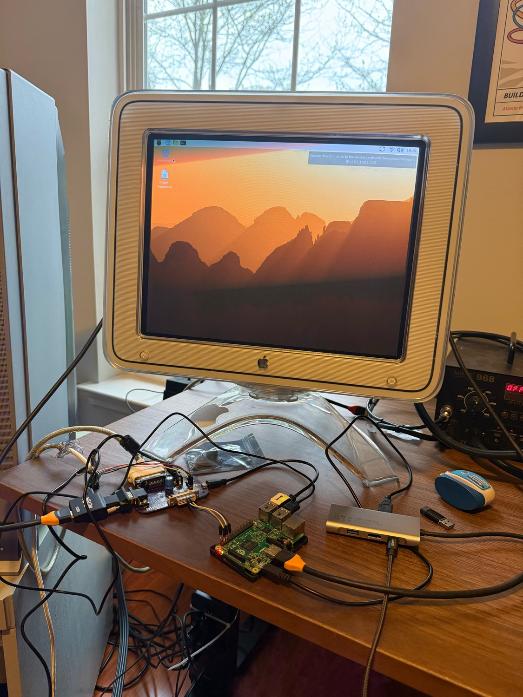
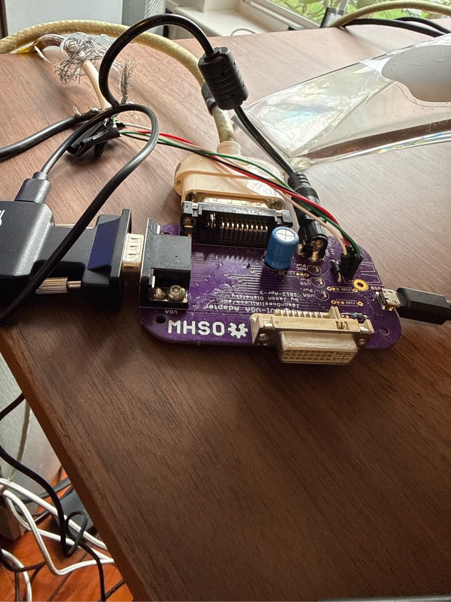
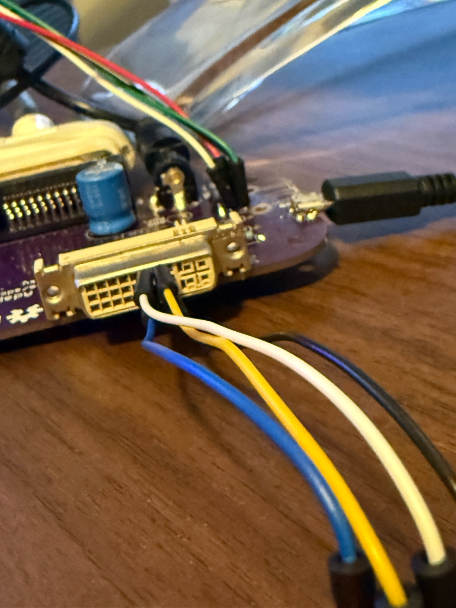

# Pi Studio Display

Control an Apple Studio Display 17" CRT (M7768) from a Raspberry Pi using a Jason "Does It All" ADC adapter. Wire 4 jumper cables from the Pi's GPIO to the adapter's DVI port, install the .deb package, and the monitor powers on at boot with full geometry calibration from the desktop.



## Quick Start

### 1. Wire the Pi to the DVI port on the Jason adapter



| Pi Pin | Pi Function | DVI Pin | DVI Function |
|--------|-------------|---------|--------------|
| Pin 2 | 5V | Pin 14 | +5V Power |
| Pin 3 | SDA1 | Pin 7 | DDC Data |
| Pin 5 | SCL1 | Pin 6 | DDC Clock |
| Pin 9 | GND | Pin 15 | DDC Ground |

```
        DVI-I Female — front face
        ─────────────────────────────────────────
 Row 1:  1    2    3    4    5   [6]  [7]   8
                                 SCL  SDA

 Row 2:  9   10   11   12   13  [14] [15]  16
                                 5V   GND
```



### 2. Enable I2C on the Pi

```bash
sudo apt update && sudo apt install -y i2c-tools
sudo raspi-config nonint do_i2c 0
echo i2c-dev | sudo tee -a /etc/modules
sudo reboot
```

### 3. Build and install usbmonctl

```bash
cd usbmonctl
make
sudo cp usbmonctl /usr/local/bin/
```

### 4. Build and install the control package

```bash
cd pi-ADC-controller
make deb
sudo apt install ./pi-adc-control_2.0_all.deb
```

### 5. Reboot

The monitor powers on automatically at boot. Use **Ctrl+Alt+P** to toggle power, or open **Preferences > ADC CRT Control** for geometry adjustments.

## Verify wiring

```bash
sudo i2cdetect -y 1
```

You should see `37` (DDC/CI controller) and `50` (EDID EEPROM). If not, check your wiring.

## How it works

The monitor has two communication paths through the Jason adapter, and each one can do something the other can't:

- **USB HID** (via `usbmonctl`) reads the monitor's power state and adjusts settings, but power control is read-only.
- **DDC/CI over DVI pins** (via `i2ctransfer`) can set power state through the Pi's GPIO I2C bus, but can't read anything back.

The toggle script reads state over USB, then sends the opposite command over I2C.

### DDC/CI command bytes

| Byte | Value (on / off) | Meaning |
|------|-------------------|---------|
| 1 | `0x51` | Source address (host) |
| 2 | `0x84` | Length: `0x80` flag + 4 data bytes |
| 3 | `0x03` | Opcode: Set VCP Feature |
| 4 | `0xD6` | VCP code: power state |
| 5 | `0x00` | Value high byte |
| 6 | `0x01` / `0x04` | Value low byte (1=on, 4=off) |
| 7 | `0x6F` / `0x6A` | XOR checksum |

### Manual commands

```bash
# Power on
sudo i2ctransfer -y 1 w7@0x37 0x51 0x84 0x03 0xD6 0x00 0x01 0x6F

# Power off
sudo i2ctransfer -y 1 w7@0x37 0x51 0x84 0x03 0xD6 0x00 0x04 0x6A

# Read current state (1=on, 2=sleep, 4=off)
sudo usbmonctl -g F,0xD6
```

## Video setup

The DVI port is occupied by the I2C wires, so video goes through the VGA port on the Jason adapter. Use an HDMI-to-VGA adapter from the Pi's HDMI output.

## What's in the package

- **crt-daemon** — powers on the monitor at boot (systemd oneshot service)
- **crt-toggle** — toggles power from the command line or keyboard shortcut
- **pi-adc-gui.py** — GTK3 GUI for geometry, degauss, and power control
- **crt_backend.py** — shared Python backend for all monitor communication

## Credits

- [Jason "Does It All" ADC adapter](https://jasondoesitall.com) — makes the whole thing possible
- [usbmonctl](https://github.com/OndrejZary/usbmonctl) by Ondrej Zary — USB HID monitor control for Linux
- [monitorcontrol](https://github.com/newAM/monitorcontrol) by newAM — Python DDC/CI library (reference for the I2C protocol)
- [GUI-for-apple-studio-17-ADC](https://github.com/mega-calibrator/GUI-for-apple-studio-17-ADC) by mega-calibrator — Windows GUI that inspired this project
